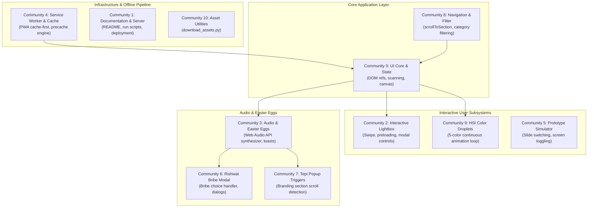
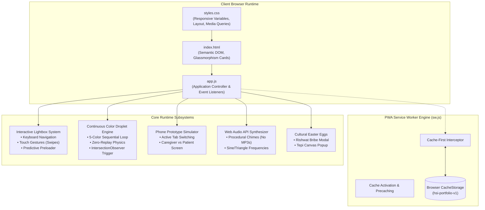
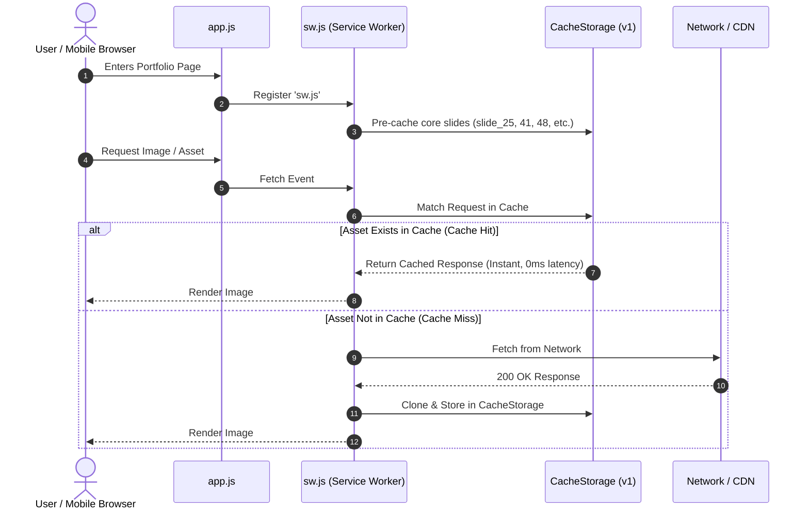
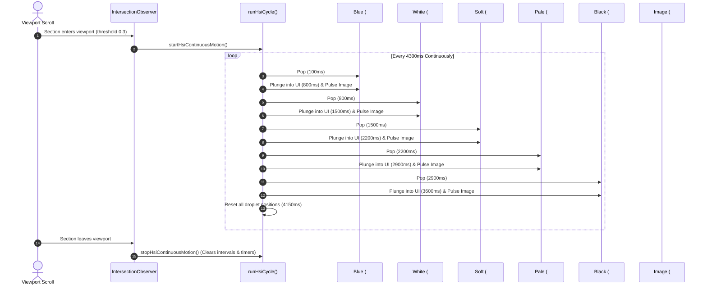

# Portfolio System Architecture & Graphify Knowledge Graph

This document provides a deep, production-grade technical breakdown of the architecture, subsystems, data flow, and knowledge graph for the portfolio codebase (`stephanie-perez-portfolio`), processed and clustered via **[Graphify](https://github.com/Graphify-Labs/graphify)**.

---

## 1. Graphify Knowledge Graph Summary

The codebase was ingested and clustered using Graphify into **77 nodes**, **88 edges**, and **11 distinct functional communities**.

### Graphify Artifacts Generated in `graphify-out/`
- **[`graphify-out/graph.html`](file:///C:/Users/sgarm/stephanie-perez-portfolio/graphify-out/graph.html)**: Interactive force-directed 2D/3D physics visualization with community clustering.
- **[`graphify-out/GRAPH_TREE.html`](file:///C:/Users/sgarm/stephanie-perez-portfolio/graphify-out/GRAPH_TREE.html)**: Collapsible D3 hierarchical tree view.
- **[`graphify-out/stephanie-perez-portfolio-callflow.html`](file:///C:/Users/sgarm/stephanie-perez-portfolio/graphify-out/stephanie-perez-portfolio-callflow.html)**: Interactive Mermaid callflow with zoom & pan controls.
- **[`graphify-out/GRAPH_REPORT.md`](file:///C:/Users/sgarm/stephanie-perez-portfolio/graphify-out/GRAPH_REPORT.md)**: God nodes, cohesion metrics, and community audit summary.
- **[`graphify-out/graph.json`](file:///C:/Users/sgarm/stephanie-perez-portfolio/graphify-out/graph.json)**: GraphRAG-ready schema of all entities, calls, and relationships.

```
Graphify Topology Metrics:
  Nodes: 77
  Edges: 88
  Communities: 11 (6 primary, 5 focused utility modules)
  Token Reduction: 3.1x query compression vs full-corpus scanning
```

---

## 2. Clustered Functional Communities



### Community Breakdown
| ID | Community Label | Node Count | Key Functions & Abstractions |
|---|---|---|---|
| **0** | **UI Core & Global State** | 41 | `allSlides`, `ctx`, `runPlantScan()`, particle loop, DOM bindings |
| **1** | **Project Documentation & Setup** | 9 | `README.md`, deployment methods, server commands |
| **2** | **Interactive Lightbox & Slide Nav** | 6 | `openLightbox()`, `navigateLightbox()`, `handleLightboxSwipe()`, `preloadNeighborSlides()` |
| **3** | **Easter Eggs & Audio Feedback** | 6 | `playCuteChime()`, `payRishwat()`, `showTepiPopup()`, `showToast()` |
| **4** | **Service Worker & Cache System** | 4 | `sw.js`, `PRECACHE_ASSETS`, cache-first fetch handler |
| **5** | **Prototype Simulator & Storage** | 2 | `switchSimSlide()`, `cacheImage()` |
| **6** | **Rishwat Modal Dialogs** | 2 | `closeRishwatPopup()`, `closeRishwatPopupDirect()` |
| **7** | **Tepi Popup Triggers** | 2 | `closeTepiPopup()`, `closeTepiPopupDirect()` |
| **8** | **Navigation & Filter Engine** | 2 | `scrollToSection()`, `filterCategory()` |
| **9** | **HSI Color Pinning Animation** | 2 | `runHsiCycle()`, `startHsiContinuousMotion()` |
| **10** | **Asset Pipeline Utilities** | 1 | `download_assets.py` |

---

## 3. Deep System Architecture

The application is structured as a zero-dependency, high-performance static client-side web application designed to run with instant responsiveness on both mobile and desktop.



---

## 4. Key Subsystem Workflows

### Subsystem A: Service Worker & Offline Image Cache
To prevent slow network loads and repeated image downloads on mobile devices, a Service Worker operates as a transparent network proxy:



### Subsystem B: HSI Healthcare 5-Color Pinning Engine
The color droplet system on slide 41 animates in a continuous, smooth, non-blocking sequence:



### Subsystem C: Predictive Lightbox & Touch Gestures
The lightbox provides native-app quality gallery browsing:
1. **Swipe Detection**: Measures `touchStartX` and `touchEndX` with a 45px threshold to trigger forward or backward navigation.
2. **Predictive Preloading**: When slide `i` is opened, `preloadNeighborSlides(i)` immediately instantiates background `new Image()` instances for slide `i - 1` and slide `i + 1`, eliminating rendering lag.
3. **Focus & Keyboard Management**: Binds `ArrowLeft`, `ArrowRight`, and `Escape` for full accessibility.

---

## 5. Web Audio API Procedural Synthesizer
Zero MP3 or WAV files are downloaded for sound effects. Instead, `playCuteChime(type)` synthesizes frequencies directly through the browser's audio hardware:
- **Pop Chime**: Generates an exponential frequency ramp from `520Hz` to `880Hz` using a `sine` oscillator over `0.15s`.
- **Success Chime**: A two-note harmonic arpeggio (`587.33Hz` D5 &rarr; `880Hz` A5) using smooth gain decay.
- **Mobile Safe**: Wrapped in an auto-resuming `AudioContext` on the first user tap to comply with mobile autoplay restrictions.

---

## 6. How to Query the Graphify Graph

You can explore the persistent knowledge graph anytime from the terminal:

```bash
# 1. Open the interactive 3D/2D force-directed knowledge graph
start graphify-out/graph.html

# 2. Open the hierarchical tree visualization
start graphify-out/GRAPH_TREE.html

# 3. Open the Mermaid callflow diagram
start graphify-out/stephanie-perez-portfolio-callflow.html

# 4. Find the shortest path between any two components
python -m graphify path "openLightbox" "PRECACHE_ASSETS"

# 5. Explain any concept or node
python -m graphify explain "runHsiCycle"

# 6. Ask semantic questions using GraphRAG BFS traversal
python -m graphify query "How does image preloading and caching work?"
```
