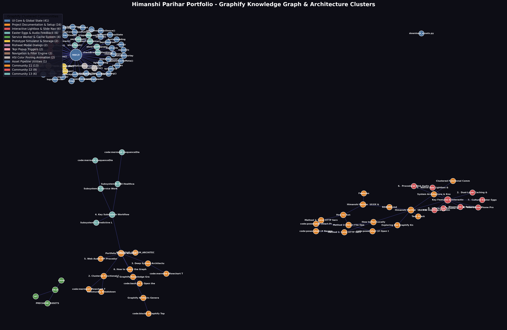

# Himanshi Parihar — UI/UX & Graphic Designer Portfolio

A high-performance, offline-first, mobile-optimized interactive portfolio website designed for **Himanshi Parihar**, based on the modern editorial Behance design portfolio architecture ([Gallery #192698055](https://www.behance.net/gallery/192698055/UI-UX-and-Graphic-Designer-Portfolio)).

Built with zero external framework dependencies using vanilla **HTML5**, **CSS3**, **modern ES6+ JavaScript**, and an offline **PWA Service Worker** with a dedicated **[Graphify](https://github.com/Graphify-Labs/graphify)** knowledge graph.

---

## 🌐 Live Interactive Architecture & Graphify Cluster

| View Type | Live Hosted Link | Description |
|---|---|---|
| 🧠 **Interactive 3D Physics Graph** | **[portfolio-4inj.onrender.com/graph.html](https://portfolio-4inj.onrender.com/graph.html)** | Real-time force-directed physics graph with draggable nodes & community filter |
| 📊 **Mermaid Call-Flow Architecture** | **[portfolio-4inj.onrender.com/callflow.html](https://portfolio-4inj.onrender.com/callflow.html)** | Interactive visual callflow diagram with zoom & pan controls |
| 🌲 **Hierarchical D3 Tree** | **[portfolio-4inj.onrender.com/tree.html](https://portfolio-4inj.onrender.com/tree.html)** | Collapsible directory & symbol dependency hierarchy |
| 📄 **System Architecture Report** | **[`PORTFOLIO_SYSTEM_ARCHITECTURE.md`](./PORTFOLIO_SYSTEM_ARCHITECTURE.md)** | Deep technical report with sequence diagrams & subsystem specs |

### 🔍 Graphify Cluster View (Rendered on GitHub)

[](https://portfolio-4inj.onrender.com/graph.html)

> 💡 **Interactive Mode**: Click the graph image above to explore the live interactive physics simulation in full screen!

---

## 🌟 Key Features & Interactive Systems

### 1. 🎨 HSI Healthcare Continuous 5-Color Pinning Engine
- **Full 5-Color System**: Interactively pins all 5 brand color swatches directly matching slide 41:
  - `#1A49FF` Clinical Blue
  - `#FAFAFA` Canvas White
  - `#B4C2FA` Soft Tint
  - `#D8E0FF` Pale Tint
  - `#1F1F1F` Deep Black
- **Continuous Motion Physics**: Droplets sequence automatically in a fluid 4300ms pop-and-plunge loop with image brightness pulsation.
- **Single-Line Guarantee**: Responsive typography and `white-space: nowrap;` ensure badges and text never break into awkward multiline blocks on mobile screens.
- **Battery-Friendly Observer**: Activates via `IntersectionObserver` when scrolled into view and suspends execution when out of viewport.

### 2. ⚡ Dual-Layer Caching & Offline PWA Engine (`sw.js`)
- **Service Worker Interceptor**: Transparent proxy running in `sw.js` with Cache-First strategy (`hsi-portfolio-v1`).
- **Instant Image Delivery**: Pre-caches high-resolution case study slides on first launch, ensuring instant 0ms loads and zero blank images on mobile devices.
- **Predictive Lightbox Preloader**: Automatically pre-fetches and decodes adjacent slides ($i-1$ and $i+1$) in the background while viewing any lightbox image.

### 3. 🖼️ Native-App Lightbox & Touch Gestures
- **Swipe-to-Navigate**: Full touch event listener (`touchstart`, `touchend`) recognizing left/right swipes with a 45px distance threshold.
- **Keyboard Traps & Accessibility**: Seamless navigation via `ArrowLeft`, `ArrowRight`, and `Escape`.
- **Slide Counters & Captions**: Dynamic HUD indicating current slide position and metadata.

### 4. 📱 Interactive Phone Prototype Simulator
- **Interactive Flow Explorer**: Toggle between contextual case study overviews and the complete 9-screen clinical workflow.
- **Live Tab Switching**: Simulated mobile app UI toggling between Caregiver schedule, Patient medication logs, and clinical alerts.

### 5. 🌿 Bloomcare AI Botanical Scanner Simulator
- **Interactive Diagnosis**: Click-to-scan camera simulation identifying *Monstera Deliciosa* with real-time health scoring and dynamic recovery timelines.

### 6. 🔊 Procedural Web Audio API Synthesizer
- **Zero MP3/WAV Dependencies**: Generates lightweight mathematical audio frequencies directly using browser `AudioContext`.
- **Custom Sound Effects**: Soft pop chimes (`520Hz &rarr; 880Hz` sine wave sweep) and victory harmonic arpeggios (`587.33Hz &rarr; 880Hz`).

### 7. 🎁 Cultural Easter Eggs
- **"Rishwat" Bribe Modal**: Intercepts external navigation links with a playful custom popup modal requesting "Cutting Chai" or "Garam Samosa" before granting access.
- **"Tepi" Artisan Popup**: Auto-triggers on reaching the Branding Systems showcase celebrating hand-crafted design and pixel precision.

### 8. 📄 Interactive Resume & Bio Drawer
- Slide-out side drawer with smooth overlay backdrop.
- Education updated to **JKLU (JK Lakshmipat University)** (3-year design program).
- Career timeline (NCL Holdings, AIC Hotel Group, ACL, Akane Digital, MultiCuba), skills, and software toolset.

---

## 🏗️ System Architecture & Knowledge Graph

This portfolio includes a deep technical architecture blueprint and a persistent **[Graphify](https://github.com/Graphify-Labs/graphify)** knowledge graph:

- **[`PORTFOLIO_SYSTEM_ARCHITECTURE.md`](./PORTFOLIO_SYSTEM_ARCHITECTURE.md)**: Comprehensive architectural breakdown with Mermaid sequence diagrams.
- **[`graphify-out/graph.html`](./graphify-out/graph.html)**: Interactive 2D/3D force-directed physics graph.
- **[`graphify-out/GRAPH_TREE.html`](./graphify-out/GRAPH_TREE.html)**: D3 v7 collapsible hierarchy tree.
- **[`graphify-out/stephanie-perez-portfolio-callflow.html`](./graphify-out/stephanie-perez-portfolio-callflow.html)**: Interactive Mermaid callflow diagram with zoom & pan.
- **[`graphify-out/GRAPH_REPORT.md`](./graphify-out/GRAPH_REPORT.md)**: Structural audit and community cohesion report.

### Clustered Functional Communities (77 Nodes · 88 Edges)
1. **Community 0**: UI Core & Global State (DOM bindings, canvas particle loop, typewriter effect)
2. **Community 1**: Project Documentation & Setup (`README.md`, startup configs)
3. **Community 2**: Interactive Lightbox & Slide Nav (touch gestures, predictive caching)
4. **Community 3**: Easter Eggs & Audio Feedback (Web Audio synthesizer, notifications)
5. **Community 4**: Service Worker & Cache System (`sw.js`, `CacheStorage`)
6. **Community 5**: Prototype Simulator & Storage (state toggles, slide switching)
7. **Community 6**: Rishwat Modal Dialogs (modal open/close controllers)
8. **Community 7**: Tepi Popup Triggers (scroll-triggered modal)
9. **Community 8**: Navigation & Filter Engine (category filters, smooth scrolling)
10. **Community 9**: HSI Color Pinning Animation (5-color continuous sequence loop)
11. **Community 10**: Asset Pipeline Utilities (`download_assets.py`)

---

## 🚀 How to Run Locally

### Method 1: Local HTTP Server (Recommended)
Because modern browsers require HTTP/HTTPS to activate Service Workers and the CacheStorage API:

```powershell
# Navigate to the portfolio folder
cd C:\Users\sgarm\stephanie-perez-portfolio

# Start Python HTTP server on port 8080
python -m http.server 8080
```
Open **[http://localhost:8080](http://localhost:8080)** in your browser.

### Method 2: Direct File Open
You can also launch `index.html` directly in any web browser:
```powershell
Start-Process "C:\Users\sgarm\stephanie-perez-portfolio\index.html"
```

---

## 🔍 Exploring the Graphify Knowledge Graph

Explore the codebase relationships and architecture using the installed Graphify CLI:

```powershell
# Open the interactive 3D/2D physics graph
Invoke-Item graphify-out\graph.html

# Open the Mermaid callflow diagram
Invoke-Item graphify-out\stephanie-perez-portfolio-callflow.html

# Find the shortest path between any two components
python -m graphify path "openLightbox" "PRECACHE_ASSETS"

# Explain any function and its neighbors
python -m graphify explain "runHsiCycle"

# Ask semantic architectural questions
python -m graphify query "How does image caching and offline support work?"

# Update the graph after code changes (free, no LLM required)
python -m graphify update .
```

---

## 🛠️ Tech Stack

- **Markup**: Semantic HTML5 with accessible ARIA tags
- **Styling**: Vanilla CSS3, CSS Custom Properties, Glassmorphism, CSS Grid, Flexbox
- **Scripting**: Vanilla ES6+ JavaScript (zero frameworks, zero runtime bloat)
- **Audio**: Web Audio API (Hardware synthesized sound effects)
- **Offline / PWA**: Service Worker API, CacheStorage API
- **Knowledge Architecture**: Graphify Knowledge Graph Engine
